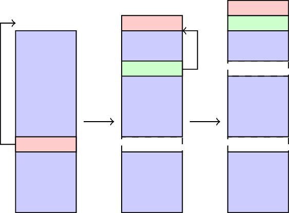

# Week 4 -  Sorting and Searching Algorithms

This lab sheet will introduce two algorithms from computer science. After this session you will be able to sort and search lists using the two following algorithms:

+ Insertion and Bubble sort algorithm;
+ Binary search.

## Sorting Algorithms

1. **TICKABLE** The following code create a list of digits from 1 to 31.

        l = range(1, 31)
        print l

    If we import the random library we can pick a random sample of the list and `shuffle` this it (do not worry too much about this):

        import random
        jumbledlist = random.sample(range(1, 31), 20)
        random.shuffle(jumbledlist)
        print jumbledlist

    Using pen and paper, sort the above list, attempting to understand a general approach to doing this. Write a function `jumbledlist` that takes as arguments: `maximumnumber` and `sizeoflist` which returns a jumbled list of integersas above.

2. **TICKABLE** Python has a built in method on lists to sort them: `sort()`:

        l = jumbledlist(30, 20) # Use the function you created above.
        print l
        l.sort()
        print l

    In this question we will take a look at one type of algorithm that can be used to sort a list: "Selection sort".

    The main idea behind this algorithm is to create a new (empty at first) list and go through the old list and slowly pick out the 'next' element to go in the new list.

    

    Here is some **pseudo code** that describes this:

        INITIATE NEWLIST
        WHILE MORE ELEMENTS IN NEWLIST THAN IN OLDLIST:
            FIND SMALLEST ELEMENT IN OLDLIST
            MOVE THAT ELEMENT TO NEWLIST

    It should be straightforward to see that at every step of this algorithm we the total size of NEWLIST and OLDLIST stay the same. As such we can simply put the NEWLIST at the beginning of the OLDLIST so that at each step of our algorithm we are basically moving elements from the unsorted part of the list to the sorted part of the list.

    

    Here is some **pseudo code** that describes the 'insertion sort' algorithm:

        SET FIRSTUNSORTED TO 0
        WHILE NOT SORTED:
            FIND SMALLEST UNSORTED ITEM
            SWAP FIRST UNSORTED ITEM WITH EARLIEST UNSORTED ITEM
            SET FIRSTUNSORTED TO FIRSTUNSORTED + 1

    Here is some python code that carries out the above algorithm, experiment with it and include comments:

        def insertionsort(data):
            firstunsorted = 0
            while firstUnsorted < len(data) - 1:
                indexOfSmallest = firstUnsorted
                index = firstUnsorted + 1
                while index <= len(data) - 1:
                    if data[index] < data[indexOfSmallest]:
                        indexOfSmallest = index
                    index += 1
                data[firstUnsorted], data[indexOfSmallest] = data[indexOfSmallest], data[firstUnsorted]
                firstUnsorted += 1

3. Pseudo code for bubble sort asking student to code it themselves.
4. Timeing module to compare both of the above algorithms on a series of data files...

## Searching algorithms

5. **TICKABLE** Search a list by hand.
6. **TICKABLE** Code for iterative binary search.
7. Code for recursive binary search.
