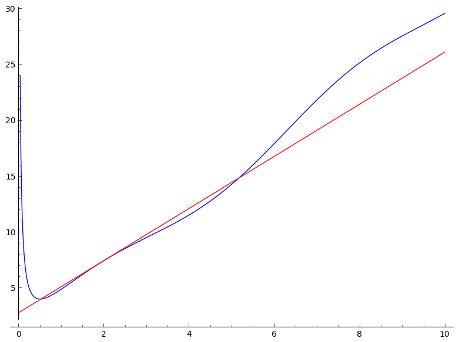

# Week 7 - Symbolic Calculus

Using Sage we can carry out various operations from Calculus. This week we will investigate how to:

- Carry out limits in Sage;
- Carry out differentiation in Sage;
- Carry out integration in Sage.

1. Last week we saw how to define a function in Sage:

    f(x) = x ^ 3 + 3 * x + sin(x)

    To obtain the variables of a function we can use the `variables` method:

    print f.variables()

    Try this with a function of more than one variable:

    f(x, y) = x * y + x ^ 2 + y ^ 2

2. In calculus the following definition of a limit is well know:

    >  $\lim_{x\to a}f(x)=L$ iff $\forall\; \epsilon>0$ $\exists$ $\delta$ such that $\forall\; x$: $|x-a|<\delta$ $\Rightarrow$ $|f(x)-L|\leq \epsilon$.

    Let us calculate the limit of $f(x) = \frac{3x^2}{x^3+x-1}$ as $x\to 1$.

    First of all let us plot $f(x)$:

        plot(f(x), x, .5, 10)

    The following code obtains $\lim_{x\to 1}f$:

        f.limit(x=1)

    We can also obtain the same result using the `limit` method:

        limit(f,x=1)

    Note that $f(1)=\lim_{x\to 1}f(x)$:

        f(1)

    This implies that $f$ is continuous at 1.

3. **TICKABLE** Plot $f(x)=\frac{3x^2}{x^3+x-1}$ using the default options:

        plot(f)

    We see that Sage is plotting extremely high values at the discontinuity due to a root of the denominator which seems to be around $x=.7$. We can plot our function either side of that point and combine them. We do this by creating plot objects:

        p = plot(f, x, 0.8, 10)
        type(p)
        p += plot(f, x, -10, .6)
        type(p)
        p.show()

    and identify (use the `solve` function or the `roots` method, and maybe the `denominator` method on $f$) $\alpha$: the root of the denominator of $f$. Obtain $\lim_{x\to\alpha +}f(x)$ and $\lim_{x\to\alpha -}f(x)$. Directions of limits can be obtained using the following code:

        limit(f, x=??, dir="plus")
        limit(f, x=??, dir="minus")

4. There are various algebraic relationships on limits:

    1. $\lim_{x\to a}[f(x)+g(x)]=\lim_{x\to a}f(x) + \lim_{x\to a}g(x)$
    2. $\lim_{x\to a}[f(x)\times g(x)]=\lim_{x\to a}f(x) / \lim_{x\to a}g(x)$
    3. $\lim_{x\to a}[f(x)/g(x)]=\lim_{x\to a}f(x) / \lim_{x\to a}g(x)$ (if $\lim_{x\to a}g(a)\ne 0$)

    We can verify the first identity with the following Sage code for a particular example:

        f(x) = exp(x)
        g(x) = sin(x)
        var('a')
        L1 = limit(f(x) + g(x), x = a)
        L2 = limit(f(x), x = a) + limit(g(x), x = a)
        bool(L1 == L2)

    Note that we use the `bool` class to convert the symbolic equation `L1==L2` to a boolean variable. Verify with some example functions the other two relationships above.

5. **TICKABLE** The point of this question is to investigate $\lim_{x\to 0}\frac{sin(x)}{x}$. Using Sage:

    1. Obtain the values of $|sin(x)-x|$ for 1000 values of $x<.05$.
    2. Plot the above points, what does this indicate as to the value of the limit?
    3. Compute the limit in question using Sage.

6. The point of this question is to investigate $\lim_{x\to 0}(1+x)^{1/x}$. Using Sage:

    1. Compute the numerical value of $e$.
    2. Obtain the values of $(1+x)^{1/x}$ for 1000 values of $x<.05$.
    3. Plot the above points, what does this indicate as to the value of the limit?
    4. Compute the limit in question using Sage.

7. Sage can be used to carry out symbolic differentiation. Experiment with the syntax below for other functions:

        var('n')
        f(x) = x ^ n
        diff(f,x)

    Note that here everything is a symbolic variable!

8. The point of this question is to investigate the definition of a derivative:

    $$\frac{df}{dx}=\lim_{h\to 0}\frac{f(x+h)-f(x)}{h}$$

    1. Consider $f(x) = x^3 + 3x - 20$;
    2. Compute $\frac{f(x+h)-f(x)}{h}$;
    3. Compute the above limit as $h\to 0$ and verify that this is the derivative of $f$.

9. **TICKABLE** By definition, the derivative $f'(a)$ gives the rate of change of the tangent line at the point $(a,f(a)$. Write a function that takes as arguments a function and a point $a$ and returns the plot of the function as well as the tangent line at $a$. The plot \text{in Figure \ref{W07-img01}} shows a plot of $f(x)=\sin(x)+3x+1/x$ as well as the tangent line at $x=2$.

    

10. Differentiation rules
11. Basic integration
12. Integration by parts
13. Riemann integration
14. Numerical integration
15. Integrate polynomials in a data file
