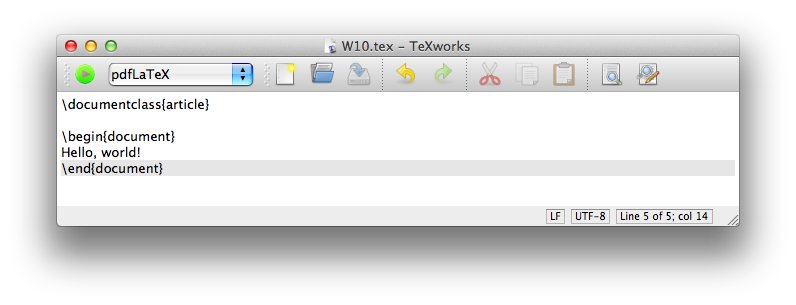

# Week 10 - LaTeX

Mathematicians, Computer Scientists, Physicists and others all need to present their research and this is usually through the written medium. Common word processors can be used for this but most prefer to use the typesetting language LaTeX (pronounced Lay-tech).

A typesetting language is a language that requires the user to write code that is then 'translated' to a form that is nice to read:

1. **TICKABLE**  Open up TeXworks which should open a blank document. Write the following LaTeX code:

        \documentclass{article}

        \begin{document}
        Hello, world!
        \end{document}

    1. Save this document.
    2. Ensure the dropdown window has "pdfLaTeX" selected.
    3. Click on the green arrow (ctrl+T) to _compile_ this document which creates a pdf corresponding to your code.

    

    **This is the most basic of LaTeX documents, everything else you do using LaTeX will be done through writing code in your TeX file.**

    There exists some good cloud based solutions to LaTeX. The advantages of these are usually:

    1. No local install of LaTeX needed;
    2. Often possible to have multiple authors collaborating on a document **at the same time**;
    3. Your files are always available to you.

    The main disadvantage is that you need an internet collection to use it. A good such site is [www.writelatex.org](writelatex.org). The following link will create a new copy online of the above document: . Feel free to either use TeXworks or writelatex throughout your learning of LaTeX.

2. **TICKABLE** The following keys are used to type text in a source file:

        a-z A-Z 0-9
        + = * / ( ) [ ]

    The following punctuation marks:

        ' ? ! : ` ' -

    Finally there are 13 special keys that are used in commands:

        # $ % & ~ _ ^ \ { } @ " |

    For example, `%` sign is used to denote comments in LaTeX (like `#` in Python or Sage). Modify your python script so that it looks like the following and compile it:

        \documentclass{article} % There are various classes of documents, we will see a few later.

        \begin{document} % This line start the document
        Hello, world!
        \end{document}

3. In general all the code that comes before the `\begin{document}` statement is called the 'preamble' and is used to set a title for the document, call certain packages as well as various other things. The following code (to be inserted in the preamble of your document) sets a title:

        \title{Choose a title}
        \author{V Knight}
        \date{\today}

    If you compile your document this won't include the title in the output. To do so you need to include the following line (in the main body):

        \maketitle

4. The following will add an abstract to your document:

        \begin{abstract}
        This document contains some basic LaTeX code that will be useful to me in the future.
        \end{abstract}

5. There are various ways to obtain lists:

        \begin{itemize}
            \item Unorderd item number 1
            \item Unorderd item number 2
        \end{itemize}

        \begin{enumerate}
            \item Ordered item number 1
            \item Ordered item number 2
        \end{enumerate}

    Note that in \LaTeX\; indentation is not required it is just good practice. Unlike Python where specific environments are delimited by indentation levels, in \LaTeX\; they are ended by specific end statements `\end{enumerate}`.

6. The following code creates a simple table (note the `c`, `r`, and `l` tags that indicate text alignment, experiment by changing these):

        \begin{tabular}{|l|c|r|}
            \hline
            Name & Gender & Start Time\\
            \hline
            Angelico & Male & 1100\\
            \hline
            Leanne & Female & 0830\\
            \hline
            Lisa & Female & 0730\\
            \hline
        \end{tabular}

    In general in \LaTeX\; `\\` is used to denote a 'new line'.

7.
8. Pictures
9. Drawings
10. Bibliography
11. Mathematics
12. Math in Text
13. Displayed mathematics
14. Text in Maths
15. Arithmetic operators
16. Integrals
17. Matrices
18. Align
19. Cases
20. Beamer
